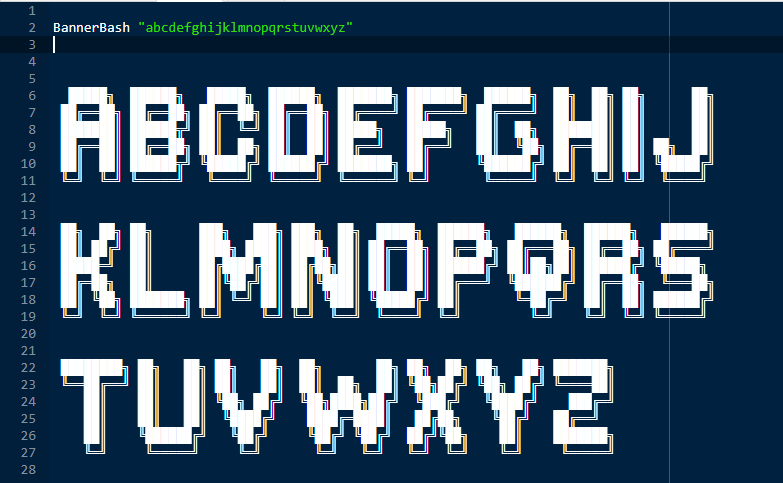
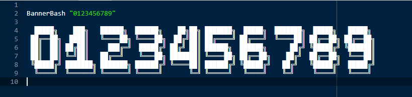
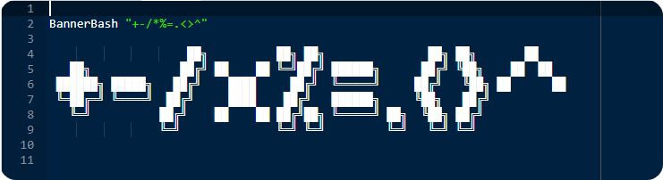
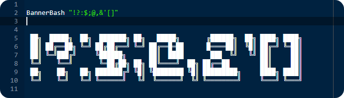

<h2 align="center">  </h2>

<p align="center">
	
<a href="https://www.google.com/search?q=web">
    
</a>
  	
<a href="https://github.com/virtualvivek/BannerBash/blob/master/LICENSE">
    
</a>

<a href="https://github.com/virtualvivek/BannerBash">
    
</a>
  
</p>


<p align="center">BannerBash is an awsome library which provides <code>large banner</code> text including <code>alphabets</code>, <code>numbers</code>, <code>maths Symbols</code>, <code>Special characters</code>to your shell script at runtime, integrating this helps your shell scripts to print <b>large headers</b> in cli with ease .It works on matrix pattern sequencer algorithm to provide fast and effective banner view.</p>

## Demo:
use command to see a live preview
```js
#!/bin/bash

$ BannerBash "Hi Banner"

 ██╗  ██╗ ██╗    ██████╗   █████╗  ███╗  ██╗ ███╗  ██╗ ███████╗ ██████╗╗
 ██║  ██║ ██║    ██╔══██╗ ██╔══██╗ ████╗ ██║ ████╗ ██║ ██╔════╝ ██╔══██╗
 ███████║ ██║    ██████╦╝ ███████║ ██╔██╗██║ ██╔██╗██║ █████╗   ██████╔╝
 ██╔══██║ ██║    ██╔══██╗ ██╔══██║ ██║╚████║ ██║╚████║ ██╔══╝   ██╔══██╗
 ██║  ██║ ██║    ██████╦╝ ██║  ██║ ██║ ╚███║ ██║ ╚███║ ███████╗ ██║  ██║
 ╚═╝  ╚═╝ ╚═╝    ╚═════╝  ╚═╝  ╚═╝ ╚═╝  ╚══╝ ╚═╝  ╚══╝ ╚══════╝ ╚═╝  ╚═╝

```

# Installation: 

Download the latest version of BannerBash : <a href="https://github.com/virtualvivek/BannerBash/releases/latest"></a>

#### Include `BannerBash` / `BannerShell` folder in your target project folder.

### BannerBash
```bash
.BannerBash/BannerBash.sh
```
### BannerShell
```sh
.BannerShell/BannerShell.sh
```

# Usage:

```js
$ BannerBash "Argument String"
	   ----
$ BannerShell "Argument String"
```

## ‣Alphabets:

```js
$ BannerBash "abcdefghijklmnopqrstuvwxyz"

```

```js
$ BannerShell "abcdefghijklmnopqrstuvwxyz"
```



## ‣Numbers:

```js
$ BannerBash "0123456789"
```

```js
$ BannerShell "0123456789"
```



## ‣Maths Symbols:

```js
$ BannerBash "+-/*%=.<>^"
```



## ‣Special Characters:

```js
$ BannerBash "!?:$;@,&'[]#"
```



# Contributors

<!-- prettier-ignore -->
<table>
  <tr>
    <td align="center">
    	<a href="https://github.com/virtualvivek">
	    <br />
	    <p><b>virtualvivek</b></p>
	    </a><br />
    	<code>  BannerBash  </code>
    </td>
    <td align="center">
    	<a href="https://github.com/gavalian">
	    <br />
	    <p><b>gavalian</b></p>
    	</a><br />
    	<code>  BannerShell  </code>
     </td>
  </tr>
</table>

## License:

BannerBash is licensed under `Apache-2.0 license`. View [license](https://github.com/virtualvivek/BannerBash/blob/master/LICENSE).<br>
Copyright (c) 2020-21. ` Vivek Verma `
