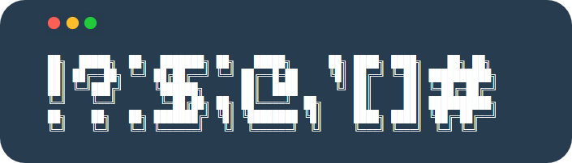

<h2 align="center">  </h2>

<p align="center">

	
<a href="https://www.google.com/search?q=web">
    
</a>

<br/>
<a href="https://github.com/virtualvivek/BannerBash/blob/master/LICENSE">
    
</a>

<a href="https://github.com/virtualvivek/BannerBash">
    
</a>
  
</p>


<p align="center">BannerBash is a library provides <b>large 3D banner</b> text to your shell script, comes with <b>alphabets</b>, <b>numbers</b>, <b>math symbols</b>, <b>special characters.</b></p>

# Demo:
Under progress -

# Text Styles

## Pixel
 
```js
​
██╗░░██╗ ██╗   ██████╗░ ░█████╗░ ███╗░░██╗ ███╗░░██╗ ███████╗ ██████╗░
██║░░██║ ██║   ██╔══██╗ ██╔══██╗ ████╗░██║ ████╗░██║ ██╔════╝ ██╔══██╗
███████║ ██║   ██████╦╝ ███████║ ██╔██╗██║ ██╔██╗██║ █████╗░░ ██████╔╝
██╔══██║ ██║   ██╔══██╗ ██╔══██║ ██║╚████║ ██║╚████║ ██╔══╝░░ ██╔══██╗
██║░░██║ ██║   ██████╦╝ ██║░░██║ ██║░╚███║ ██║░╚███║ ███████╗ ██║░░██║
╚═╝░░╚═╝ ╚═╝   ╚═════╝░ ╚═╝░░╚═╝ ╚═╝░░╚══╝ ╚═╝░░╚══╝ ╚══════╝ ╚═╝░░╚═╝

```

## Retro
 
```js
​
 █░█ █  █▄▄ ▄▀█ █▄░█ █▄░█ █▀▀ █▀█
 █▀█ █  █▄█ █▀█ █░▀█ █░▀█ ██▄ █▀▄
 
```

# Installation: 

Download the latest version of BannerBash :<br/>
<a href="https://github.com/virtualvivek/BannerBash/releases/latest">
  <br/>
</a>

Include **library folder** in your target project folder.
```js

// Choose any you like
./
 ├─ lib/
 │  ├─ pixel/
 │  │  └─ BannerBash.sh
 │  └─ retro/
 │     └─ BannerBash.sh
 └─ src/
    ├─ rust/
    │  ├─ pixel/
    │  │  └─ banner_bash.rs
    │  └─ retro/
    │     └─ banner_bash.rs
    ├─ javascript/
    │  ├─ pixel/
    │  │  └─ bannerBash.js
    │  └─ retro/
    │     └─ bannerBash.js
    └─ python/
       ├─ pixel/
       │  └─ banner_bash.py
       └─ retro/
          └─ banner_bash.py
​
```

# Usage:

<table>
<tr>
  <td><b>Language</b></td>
  <td><b>Usage</b></td>
</tr>
	
<tr>
  <td>Shell</td>
  <td>
	
  ```js
  $ BannerBash "Argument String"
  ```
  </td>
</tr>

<tr>
  <td>Rust</td>
  <td>
	
  ```rust
  let str_to_store = banner_bash("Hi".to_string())
  ```
  </td>
</tr>

</table>


<table>
<tr>
  <td><b>Symbols</b></td>
  <td><b>How it looks</b></td>
</tr>	
<tr>
  <td>Alphabets</td>
  <td></td>
</tr>
<tr>
  <td>Numbers</td>
  <td></td>
</tr>
<tr>
  <td>Maths Symbols</td>
  <td></td>
</tr>
<tr>
  <td>Special Characters</td>
  <td></td>
</tr>
</table>


# Find this library useful? :heart:
Support it by joining [**stargazers**](https://github.com/virtualvivek/BannerBash/stargazers) for this repository. :star:

# License:

BannerBash is licensed under `Apache-2.0 license`. View [license](https://github.com/virtualvivek/BannerBash/blob/master/LICENSE).<br>
Copyright (c) 2020-21. [**Vivek Verma**](https://github.com/virtualvivek)
