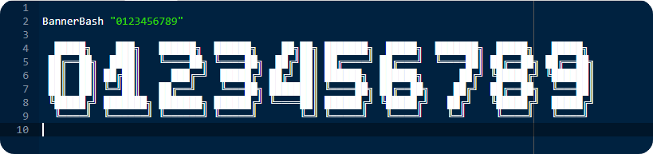

<h2 align="center">  </h2>

<p align="center">

	
<a href="https://www.google.com/search?q=web">
    
  </a>
  	
  <a href="https://github.com/vivekverma007/BannerBash">
    
  </a>
  	<a href="https://github.com/virtualvivek/BannerBash/blob/master/LICENSE">
    
  </a>
  	<a href="https://github.com/virtualvivek/BannerBash">
    
  </a>
  
  
</p>


<p align="center">BannerBash is an awsome library which provides <code>large banner</code> text including <code>alphabets</code>, <code>numbers</code>, <code>maths Symbols</code>, <code>Special characters</code>to your shell script at runtime, integrating this helps your shell scripts to print large headers in cli with ease .It works on matrix pattern sequencer algorithm to provide fast and effective banner view.</p>

## Demo:
use command to see a live preview
``` shell

$ wget -O - https://raw.githubusercontent.com/virtualvivek/BannerBash/master/library/BannerBash.sh | bash

 ██╗  ██╗ ██╗    ██████╗   █████╗  ███╗  ██╗ ███╗  ██╗ ███████╗ ██████╗ 
 ██║  ██║ ██║    ██╔══██╗ ██╔══██╗ ████╗ ██║ ████╗ ██║ ██╔════╝ ██╔══██╗
 ███████║ ██║    ██████╦╝ ███████║ ██╔██╗██║ ██╔██╗██║ █████╗   ██████╔╝
 ██╔══██║ ██║    ██╔══██╗ ██╔══██║ ██║╚████║ ██║╚████║ ██╔══╝   ██╔══██╗
 ██║  ██║ ██║    ██████╦╝ ██║  ██║ ██║ ╚███║ ██║ ╚███║ ███████╗ ██║  ██║
 ╚═╝  ╚═╝ ╚═╝    ╚═════╝  ╚═╝  ╚═╝ ╚═╝  ╚══╝ ╚═╝  ╚══╝ ╚══════╝ ╚═╝  ╚═╝

```

## Installation: 

Download the latest version of BannerBash : <a href="https://github.com/virtualvivek/BannerBash/releases/latest"></a>

Include `BannerBash` folder in your target project folder.

Add library function in your `shell script` using:

```shell
.BannerBash/library/BannerBash.sh

```

## Usage:

To print `Banner` use function :-

```shell
$ BannerBash "Argument String"

```
## Alphabets:


## Numbers:


## Maths Symbols:


## Special Characters:


## License:

BannerBash is licensed under `Apache-2.0 license`. View [license](https://github.com/virtualvivek/BannerBash/blob/master/LICENSE).<br>
Copyright (c) 2020. ` Vivek Verma `

