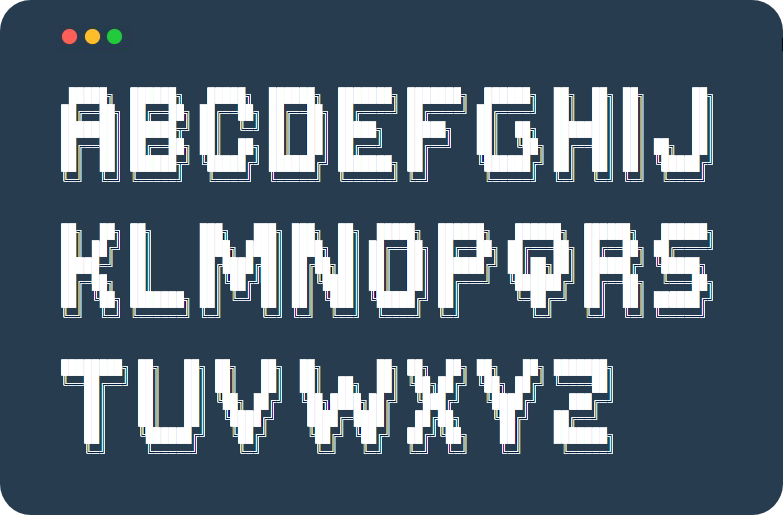

<h2 align="center">  </h2>

<p align="center">

	
<a href="https://www.google.com/search?q=web">
    
</a>

<br/>
<a href="https://github.com/virtualvivek/BannerBash/blob/master/LICENSE">
    
</a>

<a href="https://github.com/virtualvivek/BannerBash">
    
</a>
  
</p>


<p align="center">BannerBash is a library provides <b>large 3D banner text</b> to your shell script, comes with <br/><b><code>alphabets</code></b>, <b><code>numbers</code></b>, <b><code>math symbols</code></b> & <b><code>special characters.</code></b></p>

# Demo 🔆

https://virtualvivek.github.io/BannerBash/

# Text Styles

## Pixel
 
```js
​
██╗░░██╗ ██╗   ██████╗░ ░█████╗░ ███╗░░██╗ ███╗░░██╗ ███████╗ ██████╗░
██║░░██║ ██║   ██╔══██╗ ██╔══██╗ ████╗░██║ ████╗░██║ ██╔════╝ ██╔══██╗
███████║ ██║   ██████╦╝ ███████║ ██╔██╗██║ ██╔██╗██║ █████╗░░ ██████╔╝
██╔══██║ ██║   ██╔══██╗ ██╔══██║ ██║╚████║ ██║╚████║ ██╔══╝░░ ██╔══██╗
██║░░██║ ██║   ██████╦╝ ██║░░██║ ██║░╚███║ ██║░╚███║ ███████╗ ██║░░██║
╚═╝░░╚═╝ ╚═╝   ╚═════╝░ ╚═╝░░╚═╝ ╚═╝░░╚══╝ ╚═╝░░╚══╝ ╚══════╝ ╚═╝░░╚═╝

```

## Retro
 
```js
​
 █░█ █  █▄▄ ▄▀█ █▄░█ █▄░█ █▀▀ █▀█
 █▀█ █  █▄█ █▀█ █░▀█ █░▀█ ██▄ █▀▄
 
```

# Installation: 

Download the latest version of BannerBash :<br/>
<a href="https://github.com/virtualvivek/BannerBash/releases/latest">
  <br/>
</a>

Include **library folder** in your target project folder.
```js

// Choose any you like
./
 ├─ lib/
 │  ├─ pixel/BannerBash.sh
 │  └─ retro/BannerBash.sh
 └─ src/
    │
    ├─ javascript/
    │  ├─ pixel/bannerBash.rs
    │  └─ retro/bannerBash.rs
    │
    ├─ rust/
    │  ├─ pixel/banner_bash.js
    │  └─ retro/banner_bash.js
    │
    └─ python/
       ├─ pixel/banner_bash.py
       └─ retro/banner_bash.py
​
```

# Usage:

<table>
<tr>
  <td><b>Language</b></td>
  <td><b>Usage</b></td>
</tr>
	
<tr>
  <td>Shell</td>
  <td>
	
  ```js
  $ BannerBash "Argument String"
  ```
  </td>
</tr>

<tr>
  <td>JavaScript</td>
  <td>
	
  ```html
  <head>
    <meta http-equiv="Content-Type" content="text/html; charset=utf-8">
    <script src="./src/javascript/pixel/bannerBash.js"></script>
    <script src="./src/javascript/retro/bannerBash.js"></script>
  </head>
  ```
	  
  ```js
  let val_px = Pixel.bannerBash("Hi pixel text");
  let val_rt = Retro.bannerBash("Hi retro text");
  ```
  </td>
</tr>

<tr>
  <td>Rust</td>
  <td>
	
  ```rust
  let str = banner_bash("Hi".to_string());
  ```
  </td>
</tr>
	
<tr>
  <td>Python</td>
  <td>
	
  ```py
  str = banner_bash("Hi World")
  print(str)
  ```
  </td>
</tr>

</table>


<table>
<tr>
  <td><b>Symbols</b></td>
  <td><b>How it looks</b></td>
</tr>	
<tr>
  <td>Alphabets</td>
  <td></td>
</tr>
<tr>
  <td>Numbers</td>
  <td></td>
</tr>
<tr>
  <td>Maths Symbols</td>
  <td></td>
</tr>
<tr>
  <td>Special Characters</td>
  <td></td>
</tr>
</table>


# Find this library useful? :heart:
Support it by joining [**stargazers**](https://github.com/virtualvivek/BannerBash/stargazers) for this repository. :star:

# License:

BannerBash is licensed under `Apache-2.0 license`. View [license](https://github.com/virtualvivek/BannerBash/blob/master/LICENSE).<br>
Copyright (c) 2020-21. [**Vivek Verma**](https://github.com/virtualvivek)
